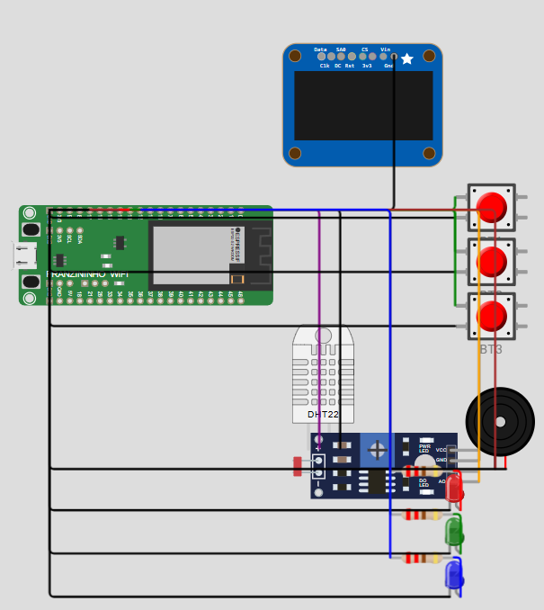
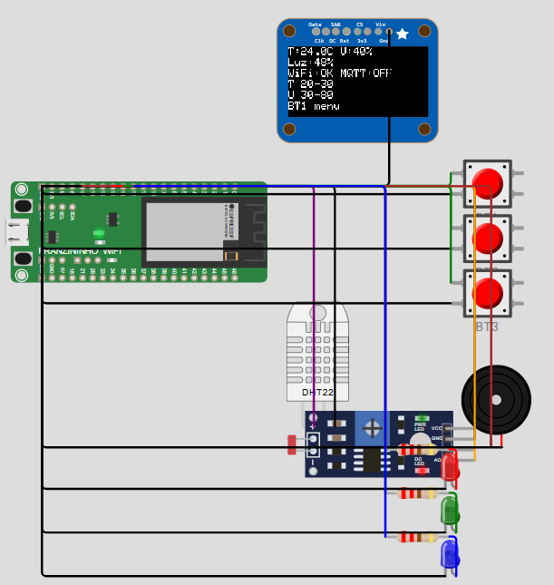

# 🌱 Estação Inteligente de Monitoramento Ambiental (Franzininho WiFi)

Simulação de sistema embarcado desenvolvido com **Franzininho WiFi (ESP32)** para monitoramento ambiental em tempo real, com integração IoT via **MQTT (Adafruit IO)**, interface local com **OLED**, controle por botões e armazenamento de logs.

---

## 📌 Visão Geral

Este projeto simula uma estação inteligente capaz de:

* Monitorar **temperatura**, **umidade** e **luminosidade**
* Exibir dados em um display OLED
* Gerenciar limites configuráveis pelo usuário
* Detectar condições de alarme
* Enviar dados para a nuvem (Adafruit IO)
* Registrar eventos em memória (LittleFS)
* Permitir interação local via botões

---

## ⚙️ Tecnologias Utilizadas

* ESP32 (Franzininho WiFi)
* Arduino Framework
* MQTT (Adafruit IO)
* Wokwi Simulator
* FreeRTOS (conceitos aplicados)
* LittleFS (armazenamento local)
* Preferences (persistência de configuração)

---

## 🧰 Arquitetura simulada do projeto final no Wokwi

<!-- PROJECT LOGO -->
<br />
<div align="center">
  <a href="https://github.com/adonias-caetano/projeto_embarcados_estacao_IoT_franzininho_WiFi_LAB01_wokwi.git">
    
  </a>
</div>

<!-- PROJECT LOGO -->
<br />
<div align="center">
  <a href="https://github.com/adonias-caetano/projeto_embarcados_estacao_IoT_franzininho_WiFi_LAB01_wokwi.git">
    
  </a>
</div>

---

## 📚 Bibliotecas Utilizadas

Conforme definido em `libraries.txt` :

* PubSubClient
* Adafruit GFX
* Adafruit SSD1306
* DHT sensor library for ESPx

---

## 🚀 Funcionalidades

### 📊 Monitoramento

* Temperatura (°C)
* Umidade (%)
* Luminosidade (%)

### 📟 Interface OLED

* Exibição dos sensores
* Status de WiFi e MQTT
* Limites configurados
* Indicação de alarmes

### 🔔 Sistema de Alarmes

* Disparado quando valores ultrapassam limites
* Ativa buzzer e mensagem visual
* Registro em log interno
* Envio para MQTT

### 🌐 Integração IoT

* Publicação de dados no Adafruit IO:

  * temperatura
  * umidade
  * luminosidade
* Recebimento de comandos para LED RGB

### 💾 Armazenamento

* Logs salvos em `LittleFS`
* Configurações persistidas com `Preferences`

### 🎛️ Interação com Botões

| Botão | Função                              |
| ----- | ----------------------------------- |
| BT1   | Menu / Confirmar / Silenciar buzzer |
| BT2   | Incrementar                         |
| BT3   | Decrementar                         |

---

## ☁️ Configuração do MQTT (Adafruit IO)

Antes de executar, configure no código:

```cpp
const char* AIO_USERNAME = "SEU_USUARIO";
const char* AIO_KEY      = "SUA_AIO_KEY";
```

### 📡 Broker MQTT

* Host: `io.adafruit.com`
* Porta: `1883`

### 📌 Feeds utilizados

* `temperatura`
* `umidade`
* `luminosidade`
* `alarmes`
* `led-r`
* `led-g`
* `led-b`

---
